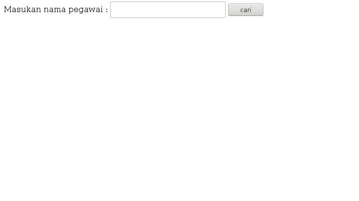

Aplikasi Searching PHP MySQL
====
Setelah latihan query selanjutnya kita belajar membuat aplikasi searcing sederhana

Pertama pelajari dulu tentang Aplikasi *Query Sederhana Dengan PHP dan MySQL* pada [datapegawaiphp](http://github.com/datapegawaiphp)  

Membuat Folder Project php-seacrh
---
1. Buatlah folder php-serach di www atau htdocs
2. Buatlah file *index.php* dan *search.php*

Membuat File index.php yang Berisi Form Pencarian
----
Script ini digunakan untuk tampilan mencari , form input kata kunci , dan tombol cari berikut code nya

```
<?php
$nama = $_POST[nama];
$koneksi = mysql_connect("localhost","root","");
mysql_select_db("pegawai");
$query = "select * from datapegawai where nama='$nama'";
$hasil = mysql_query($query);
while($data=mysql_fetch_array($hasil)) 
{
	# code...
	echo $data[0]." ".$data[1]." ".$data[2]." ".$data[3]."<br/>";
}
mysql_close($koneksi)
?>
```
Berikut hasil code ketika di run di browser


Membuat File *search.php* yang Berisi Form Pencarian
----
Script ini digunakan untuk memproses pencarian , terdapat pula script untuk mengkoneksikan dengan database. ingat anda harus mempraktikan tutorial [datapegawaiphp](http://github.com/datapegawaiphp)  
:smile: berikut script nya 

```
<?php
$nama = $_POST[nama];
$koneksi = mysql_connect("localhost","root","");
mysql_select_db("pegawai");
$query = "select * from datapegawai where nama='$nama'";
$hasil = mysql_query($query);
while($data=mysql_fetch_array($hasil)) 
{
	# code...
	echo $data[0]." ".$data[1]." ".$data[2]." ".$data[3]."<br/>";
}
mysql_close($koneksi)
?>
```
Run di Browser localhost/php-search
----
Coba run di browser dan akan tampil . Kemudian coba 

ketikan "dede" dan enter 


maka akan ketemu hasil pencarian seperti berikut ini 


Selamat belajar PHP 